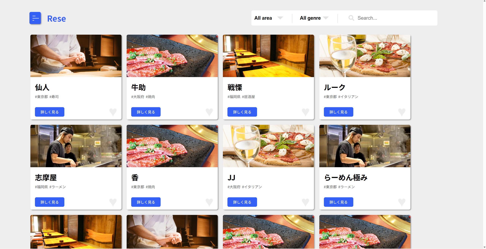
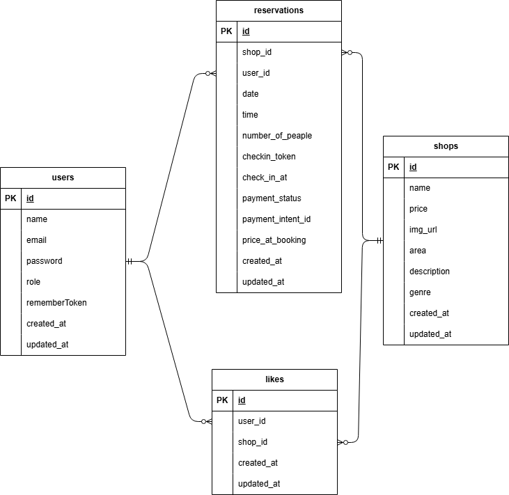

# Rese
概要説明(ある企業のグループ会社の飲食店予約サービス)


## 作成した目的
概要説明(外部の飲食店予約サービスは手数料を取られるので自社で予約サービスを持ちたい。)

## アプリケーションURL
デプロイのURLを張り付ける
http://localhost

ログインなどがあれば、注意事項など
ヘッダーのRese iconをクリックするとlogout 中はmenu1表示して、login  できる、また、login 中はmenu2 表示してlogoutできる。どちらのメニューもHOME（店舗一覧）へ案内される。

## 他のリポジトリ
関連するリポジトリがあれば記載する
例) バックエンドのリポジトリ、フロントエンドのリポジトリ

## 機能一覧
- 会員登録機能
- ログイン機能
- ログアウト機能
- ユーザー情報取得
- ユーザー飲食店お気に入り一覧取得
- ユーザー飲食店予約情報取得
- 飲食店一覧取得
- 飲食店詳細取得
- 飲食店お気に入り追加
- 飲食店お気に入り削除
- 飲食店予約情報追加
- 飲食店予約情報削除
- エリアで検索する
- ジャンルで検索する
- 店名で検索する
- メール認証機能
- 管理画面で店舗代表者作成機能
- 店舗代表者が店舗情報作成、更新、予約情報確認機能
- 店舗代表者が予約した利用者にお知らせメール送信する機能
- 利用者来店時、店舗側に見せるQRコード発行し、店舗側照合する機能
- Stripeを利用して決済する機能
- タスクスケジューラ利用、予約当日朝に予約情報を利用者に送信する機能


## 使用技術

- PHP 8.1.34
- Laravel 8.83.8
- MySQL 8.0.26
- nginx 1.21.1
- MailHog latest

## URL

- 開発環境：http://localhost/  
- phpMyAdmin：http://localhost:8080/  
- MailHog：http://localhost:8025/

## テーブル設計

### users テーブル

| カラム名          | 型           | primary key | unique key | not null | foreign key |
| ----------------- | ------------ | ----------- | ---------- | -------- | ----------- |
| id                | bigint       | ◯           |            | ◯        |             |
| name              | varchar(255) |             |            | ◯        |             |
| email             | varchar(255) |             | ◯          | ◯        |             |
| email_verified_at | timestamp    |             |            |          |             |
| password          | varchar(255) |             |            | ◯        |             |
| role              | varchar(255) |             |            | ◯        |             |
| remember_token    | varchar(100) |             |            |          |             |
| created_at        | timestamp    |             |            |          |             |
| updated_at        | timestamp    |             |            |          |             |

### shops テーブル

| カラム名          | 型           | primary key | unique key | not null | foreign key |
| ----------------- | ------------ | ----------- | ---------- | -------- | ----------- |
| id                | bigint       | ◯           |            | ◯        |             |
| name              | varchar(255) |             |            | ◯        |             |
| area              | varchar(255) |             | ◯          | ◯        |             |
| genre             | varchar(255) |             |            | ◯        |             |
| description       | varchar(255) |             |            | ◯        |             |
| img_url           | varchar(255) |             |              |             |             |
| shop_owener_id    | bigint       |             |            | ◯        |             |
| price             | integer       |            |            | ◯        |             |
| created_at        | timestamp    |             |            |          |             |
| updated_at        | timestamp    |             |            |          |             |

### reservations テーブル

| カラム名       | 型        | primary key | unique key | not null | foreign key      |
| -------------- | --------- | ----------- | ---------- | -------- | ---------------- |
| id             | bigint    | ◯           |            | ◯        |                  |
| user_id        | bigint    |             |            | ◯        | users(id) |
| shop_id        | bigint    |             |            | ◯        | shops(id) |
| date           | time      |             |            |          |                  |
| time           | time      |             |            |          |                  |
| number_of_peaple           | integer      |             |            |          |                  |
| checkin_token           | string      |             |            |          |                  |
| check_in_at           | timestamp      |             |            |          |                  |
| payment_status | string    |             |            | ◯        |                  |
| payment_intent_id           |       |             |            |          |                  |
| price_at_booking |integer       |             |            |          |                  |
| created_at     | timestamp |             |            |          |                  |
| updated_at     | timestamp |             |            |          |                  |

### likes テーブル

| カラム名       | 型        | primary key | unique key | not null | foreign key      |
| -------------- | --------- | ----------- | ---------- | -------- | ---------------- |
| id             | bigint    | ◯           |            | ◯        |                  |
| reservation_id | bigint    |             |            | ◯        | reservations(id) |
| user_id        | bigint    |             |            | ◯        | users(id) |
| shop_id        | bigint    |             |            | ◯        | shops(id) |
| created_at     | timestamp |             |            |          |                  |
| updated_at     | timestamp |             |            |          |                  |

### reviews テーブル

| カラム名       | 型        | primary key | unique key | not null | foreign key      |
| -------------- | --------- | ----------- | ---------- | -------- | ---------------- |
| id             | bigint    | ◯           |            | ◯        |                  |
| reservation_id | bigint    |             |            | ◯        | reservations(id) |
| user_id        | bigint    |             |            | ◯        | users(id) |
| shop_id        | bigint    |             |            | ◯        | shops(id) |
| comment        | text      |             |            |          |                  |
| created_at     | timestamp |             |            |          |                  |
| updated_at     | timestamp |             |            |          |                  |

## ER図



# 環境構築

Docker ビルド  
1. git clone git@github.com:shinzawa/tsutomu-mogi3.git
1. docker-compose up -d --build

Lavaral 環境構築  
1. docker-compose exec php bash  
1. composer install  
1. cp .env.example .env  
1. .env ファイルの変更

```
　DB_HOSTをmysqlに変更
　DB_DATABASEをlaravel_dbに変更
　DB_USERNAMEをlaravel_userに変更
　DB_PASSをlaravel_passに変更
　MAIL_FROM_ADDRESSに送信元アドレスを設定
```

5.php artisan key:generate  
6.php artisan migrate  
7.php artisan db:seed  
8.php artisan test

## ログイン情報

一般ユーザー  
　 id：general1@gmail.com／general2@gmail.com  
　 pass：password  

管理者  
　 id：admin1@gmail.com  
　 pass：password

店舗代表者
　 id：owner1@gmail.com／owner2@gmail.com/.../owner20@gmail.com  
   pass: password

